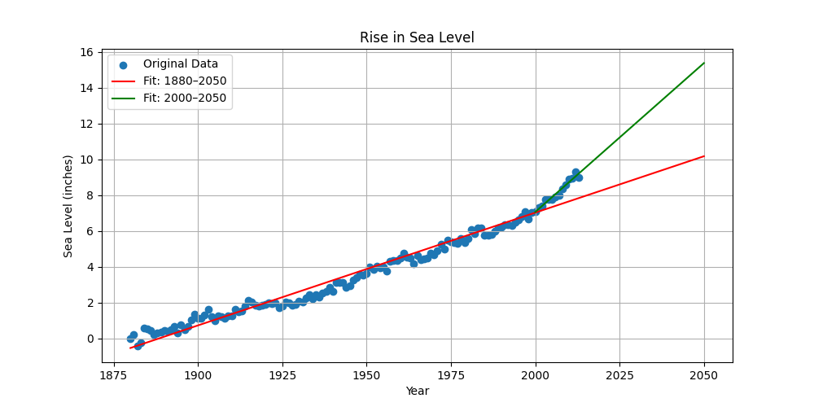

# 🌊 Sea Level Predictor

This project analyzes historical sea level data and visualizes trends over time. Using linear regression, it predicts how sea levels may rise through the year 2050.

## 📌 Overview

- Analyzed global sea level change data from 1880 to 2014
- Created scatter plots and trend lines using linear regression
- Predicted future sea level rise using both full dataset and post-2000 data
- Visualized results using Python, Pandas, Matplotlib, and SciPy

## 📁 Files Included

| File | Description |
|------|-------------|
| `sea_level_predictor.py` | Main script containing the data analysis and plotting functions |
| `epa-sea-level.csv`      | Dataset of historical sea level measurements |
| `sea_level_plot.png`     | Final output plot showing data and predictions |

## 📊 Output Plot



- **Blue Dots:** Actual data points (1880–2014)  
- **Red Line:** Linear regression on full dataset (1880–2050)  
- **Orange Line:** Regression on post-2000 data (2000–2050)

## 📈 Methodology

1. Loaded and cleaned sea level data
2. Generated scatter plot of sea level vs. year
3. Applied linear regression to find trend lines
4. Extended prediction lines to year 2050
5. Saved the final visualization as a PNG image

## 🛠️ Technologies Used

- Python
- Pandas
- Matplotlib
- SciPy

## 🚀 How to Run

1. Ensure Python 3 and required libraries are installed
2. Place `epa-sea-level.csv` in the same directory
3. Run the script:

```bash
